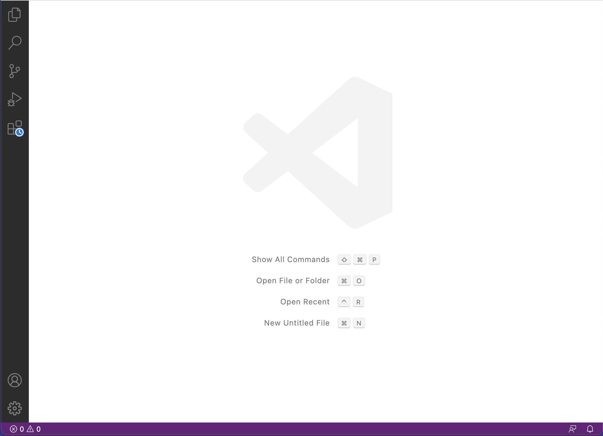
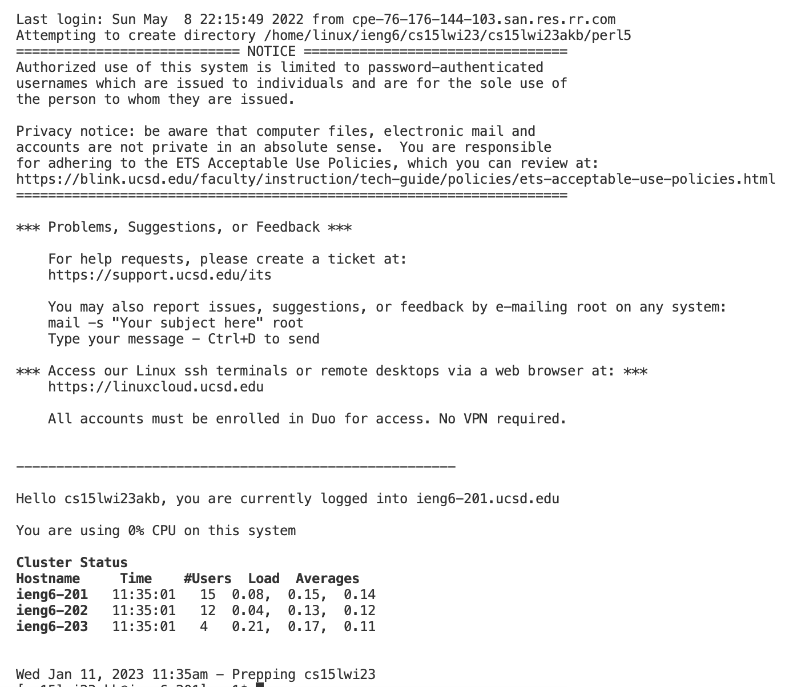
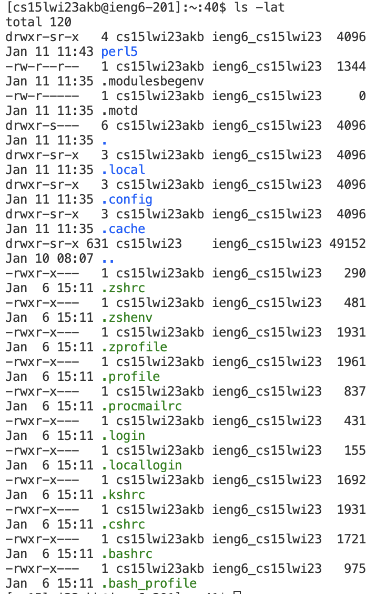

# Remote Access Tutorial
1. Go to https://code.visualstudio.com/ and follow the instructions to download it onto your computer. Now open VScode and click the X on the welcome page and your screen should look like this: 
2. Click "terminal">"new terminal" and enter `ssh cs15lwi23akb@ieng6.ucsd.edu` but replace "akb" with letters specific to your account. Type "yes" to conform the authenticity of the host and then enter your password. An output like this means that you have remotely connected to the server: 
3. Try running some commands. For example, use cd to change directories, ls to list the files in the working directory, mkdir to create a new directory. There are lots of commands but here is an example: 
You can type "exit" to log out of the remote server.
