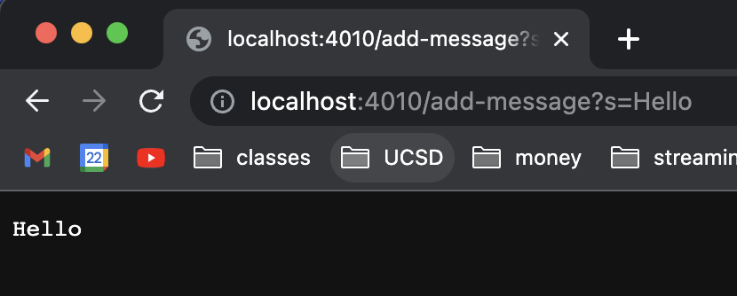
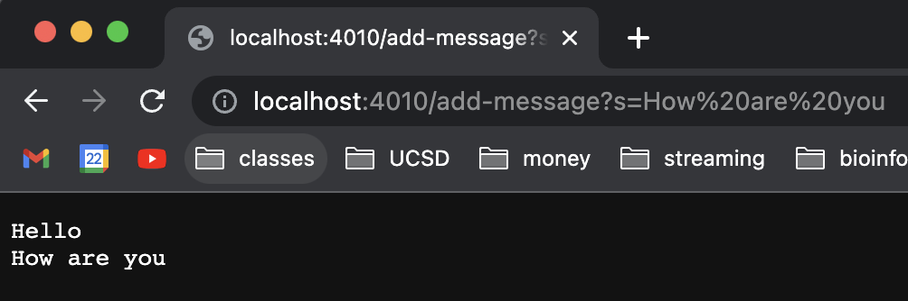

## Part 1

  
With this input, the main method in StringServer.java is called with args as a String array that just contains 4010. From this request, the port field is set to the integer 4010. The start method in Server.java is also called with the port as 4010 and the handler as StringHandler(), a class that contains the handleRequest method. The server field is set to a simple HTTP server, created using the port. ServerHttpHandler is also called, which passes in the StringHandler() as its handler.

## Part 2

## Part 3
