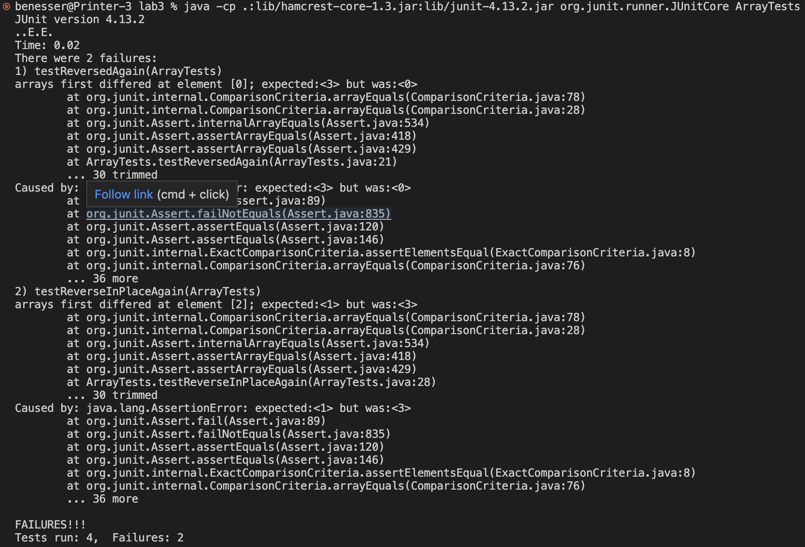

## Part 1

  
One method that is called is handleRequest with input of http://localhost:4010/add-message?s=Hello. Here the path field is set to "/add-message" and query field is set to "s=Hello". The index field is set to 1 and message field is set to "Hello". The messages field goes from empty to containing "Hello". The buildResponse() method is also called. Here the response field is set to an empty String and then "Hello" is added to it.


One method that is called is handleRequest with input of http://localhost:4010/add-message?s=How%20are%20you. Here the path field is set to "/add-message" and query is set to "s=How%20are%20you". The index field is set to 1 and message field is set to "How are you". The messages field goes from "Hello" to "Hello" and "How are you". The buildResponse method is also called. The response field is set to an empty string and then both "Hello" and "How are you" are added to it.

## Part 2

Failure-inducing input:
```
@Test
 public void testReversedAgain() {
   int[] input1 = {1,2,3};
   assertArrayEquals(new int[]{3,2,1}, ArrayExamples.reversed(input1));
 }


 @Test
 public void testReverseInPlaceAgain() {
   int[] input1 = {1,2,3};
   ArrayExamples.reverseInPlace(input1);
   assertArrayEquals(new int[]{3,2,1}, input1);
 }
```

Input that doesn't induce failure:
```
@Test
 public void testReversedAgain() {
   int[] input1 = {1};
   assertArrayEquals(new int[]{1}, ArrayExamples.reversed(input1));
 }


 @Test
 public void testReverseInPlaceAgain() {
   int[] input1 = {1};
   ArrayExamples.reverseInPlace(input1);
   assertArrayEquals(new int[]{1}, input1);
 }
```


Symptom:


The bug:  

BEFORE
```
static void reverseInPlace(int[] arr) {
    for(int i = 0; i < arr.length; i += 1) {
      arr[i] = arr[arr.length - i - 1];
    }
  }

  // Returns a *new* array with all the elements of the input array in reversed
  // order
  static int[] reversed(int[] arr) {
    int[] newArray = new int[arr.length];
    for(int i = 0; i < arr.length; i += 1) {
      arr[i] = newArray[arr.length - i - 1];
    }
    return arr;
  }
```

AFTER
```
static void reverseInPlace(int[] arr) {
    int[] arrCopy = new int[arr.length];
    for (int i=0; i<arr.length; i++) {
      arrCopy[i] = arr[i];
    }

    for(int i = 0; i < arr.length; i += 1) {
      arr[i] = arrCopy[arr.length - i - 1];
    }
  }

  // Returns a *new* array with all the elements of the input array in reversed
  // order
  static int[] reversed(int[] arr) {
    int[] newArray = new int[arr.length];
    for(int i = 0; i < arr.length; i += 1) {
      newArray[i] = arr[arr.length - i - 1];
    }
    return newArray;
  }
```

In the reverseInPlace method a copy of the array is made so it not being changed as it is being iterated on. In the reversed method the newArray is the one that we are now setting values for and it is returned at the end of the method.

## Part 3
