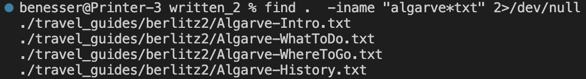
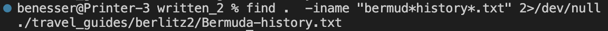
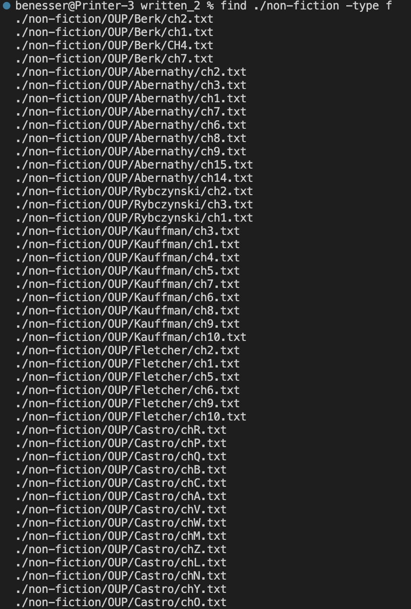
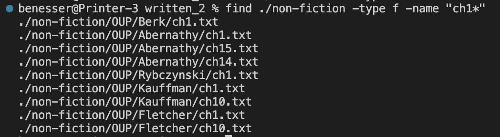
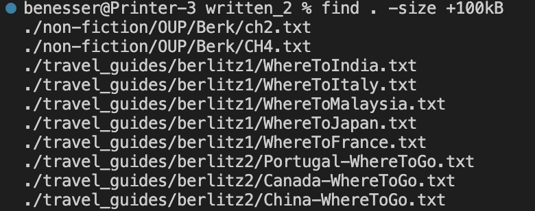
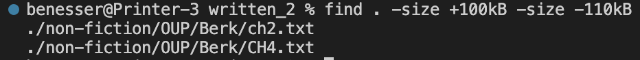
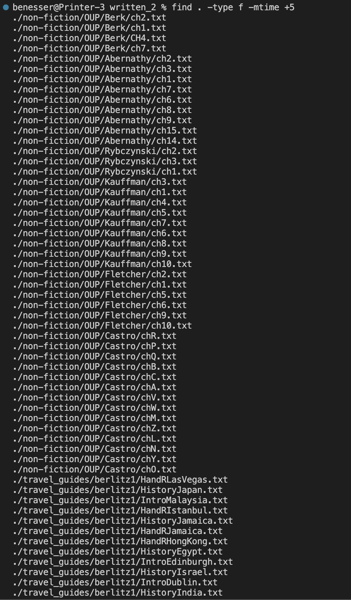

# Lab Report 3

I chose to look at the `find` command.

### -iname  
(found at [this website](https://www.redhat.com/sysadmin/linux-find-command))  
`-iname` searches for a file by approximate name, meaning that it is not case sensitive.

  
In this example, I use `-iname` to to find a txt file that contains "algarve". Even though "algarve" is not their whole name they are capitalized, the real files are still spit out. This is useful because I don't have to know the exact file name or capitalization.

 
Similar to the example above, I use iname to find a file that contains both bermud and history. Again, `-iname` allows the real file to show up, even though it is capitalized. I also don't need to know that there is a `-` in the name because I used `-iname` and connectedt the characters that I knew were in the name together by a `*`. This is useful to find a file that you know multiple parts of but not the whole name.

### -type  
(found at [this website](https://www.redhat.com/sysadmin/linux-find-command))

  
In this example, I use `-type f` to display the path of every file in the non-fiction folder. This is useful if you need to copy paste a path.

  
This example also uses the `-type f` command but it combines it with the `-name` command. This is useful for displaying the path of a specific file for a quick copy/paste.

### -size  
(found at [this website](https://www.tecmint.com/35-practical-examples-of-linux-find-command/))

  
Here I use `-size` to look at files greater in size than 100kB. This is useful to find files that are especially large or small.

  
This example uses `-size` to look at files both greater than 100kB and less than 110kB. Combining multiple commands is useful to find files of a very specific size.

### -mtime  
(found at [this website](https://geekflare.com/linux-find-commands/))

  
This example uses `-mtime` to look at files that were modified 5 days or longer ago. This is useful to look at files that are espcially new or old. The entire output could not fit into the screenshot.

  
This example uses `-mtime` to look at files that were modified between 5 days and 10 days ago. This is useful if you want to find all the files modified on a specific date or range of dates. Since everything in this directory was modified at the same time, this command's output is nothing on my computer.

